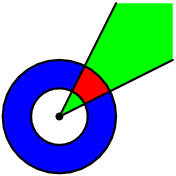

Link: <https://contest.yandex.ru/contest/29396>

## A

На числовой прямой окрасили N отрезков. Известны координаты левого и правого концов каждого отрезка (L<sub>i</sub> и R<sub>i</sub>). Найти длину окрашенной части числовой прямой.
<sup></sup>
<sub>i</sub>
### Формат ввода

В первой строке находится число N, в следующих N строках - пары L<sub>i</sub> и R<sub>i</sub>. L<sub>i</sub> и R<sub>i</sub> - целые, -10<sup>9</sup> ≤ Li ≤ Ri ≤ 10<sup>9</sup>, 1 ≤ N ≤ 15 000

### Формат вывода

Вывести одно число - длину окрашенной части прямой.

<i>Example 1:</i>

| In  | Out |
|:----|:---:|
| 1<br>10 20 | 10 |

<i>Example 1:</i>

| In  | Out |
|:----|:---:|
| 1<br>10 10 | 0 |

<i>Example 3:</i>

| In  | Out |
|:----|:---:|
| 2<br>10 20<br>20 40 | 30 |

```python
def main():
    number_of_segments = int(input())

    segments = [[0, 0] for _ in range(number_of_segments)]
    for i in range(number_of_segments):
        segments[i][0], segments[i][1] = map(int, input().split())
    segments.sort()

    painted_length = segments[0][1] - segments[0][0]
    last = segments[0][1]

    for start, end in segments[1:]:
        # Просто идем по всем отрезкам и суммируем.
        # Если текущий отрезок находится внутри предыдущего или они пересекаются,
        # то берем тот конец отрезка, что правее (больше по значению)
        painted_length += max(end, last) - max(start, last)
        last = max(last, end)

    print(painted_length)
```

## B

Идёт 2163 год. Мишу, который работает в отделении таможни при космодроме города Нью-Питер, вызвал в кабинет шеф.
Как оказалось, недавно Министерство Налогов и Сборов выделило отделению определённую сумму денег на установку новых аппаратов для автоматического досмотра грузов. Естественно, средства были выделены с таким расчётом, чтобы грузы теперь находились на таможне ровно столько времени, сколько требуется непосредственно на их досмотр.
В руках шефа каким-то образом оказались сведения о надвигающейся ревизии – список из N грузов, которые будут контролироваться Министерством. Для каждого груза известны время его прибытия, отсчитываемое с некоторого момента, хранимого в большом секрете, и время, требуемое аппарату для обработки этого груза. Шеф дал Мише задание по этим данным определить, какое минимальное количество аппаратов необходимо заказать на заводе, чтобы все грузы Министерства начинали досматриваться сразу после прибытия. Необходимо учесть, что конструкция тех аппаратов, которые было решено установить, не позволяет обрабатывать два груза одновременно на одном аппарате. Напишите программу, которая поможет Мише справиться с его задачей.

### Формат ввода

На первой строке входного файла задано число N (0 ≤ N ≤ 50 000). На следующих N строках находится по 2 целых положительных числа T<sub>i</sub> и L<sub>i</sub> – время прибытия соответствующего груза и время, требуемое для его обработки (1 ≤ T<sub>i</sub> ≤ 10<sup>6</sup>, 1 ≤ L<sub>i</sub> ≤ 10<sup>6</sup>).

### Формат вывода

В выходной файл выведите одно число – наименьшее количество аппаратов, которое нужно установить, чтобы не вызвать подозрений у Министерства.

<i>Example 1:</i>

| In  | Out |
|:----|:---:|
| 3<br>3 2<br>4 2<br>5 2 | 2 |

<i>Example 2:</i>

| In  | Out |
|:----|:---:|
| 5<br>13 4<br>15 1<br>11 5<br>12 3<br>10 3 | 3 |

```python
class Codes:
    arrival = 1
    processed = -1

def main():
    number_of_goods = int(input())
    events = list()
    for _ in range(number_of_goods):
        time_of_arrival, processing_time = map(int, input().split())
        events.append((time_of_arrival, Codes.arrival))
        events.append((time_of_arrival + processing_time, Codes.processed))
    events.sort()

    count = 0
    max_simultaneous = 0
    # Находим наибольшее значение находящихся одновременно на проверке грузов.
    # Это и есть ответ
    for time_, type_ in events:
        match type_:
            case Codes.arrival:
                count += 1
                max_simultaneous = max(max_simultaneous, count)
            case Codes.processed:
                count -= 1
    print(max_simultaneous)
```

## C

На прямой задано некоторое множество отрезков с целочисленными координатами концов [L<sub>i</sub>, R<sub>i</sub>]. Выберите среди данного множества подмножество отрезков, целиком покрывающее отрезок [0, M], (M — натуральное число), содержащее наименьшее число отрезков.

### Формат ввода

В первой строке указана константа M (1 ≤ M ≤ 5000). В каждой последующей строке записана пара чисел L<sub>i</sub> и R<sub>i</sub> (L<sub>i</sub>, R<sub>i</sub> ≤ 50 000), задающая координаты левого и правого концов отрезков. Список завершается парой нулей. Общее число отрезков не превышает 100 000.

### Формат вывода

В первой строке выходного файла выведите минимальное число отрезков, необходимое для покрытия отрезка [0; M]. Далее выведите список покрывающего подмножества, упорядоченный по возрастанию координат левых концов отрезков. Список отрезков выводится в том же формате, что и во входe. Завершающие два нуля выводить не нужно. Если покрытие отрезка [0, M] исходным множеством отрезков [L<sub>i</sub>, R<sub>i</sub>] невозможно, то следует вывести единственную фразу “No solution”.

<i>Example 1:</i>

| In  | Out |
|:----|:---:|
| 1<br>-1 0<br>-5 -3<br>2 5<br>0 0 | No solution |

<i>Example 2:</i>

| In  | Out |
|:----|:---:|
| 1<br>-1 0<br>0 1<br>0 0 | 1<br>0 1 |

```python
def main():
    length = int(input())

    x1, x2 = map(int, input().split())
    segments = list()
    while x1 or x2:
        # Добавляем только те отрезки,
        # которые пересекаются с отрезком, что нужно покрыть
        if x2 > 0 and x1 < length:
            segments.append((x1, x2))
        x1, x2 = map(int, input().split())
    
    # Если хотя бы один отрезок взяли
    if len(segments) > 0:
        segments.sort()
        min_set = []
        r_bound = 0
        next_bound = 0
        current_best = (0, 0)
        for x1, x2 in segments:
            # 2. При этом смотрим на левую границу. Как только очередной отрезок находится правее,
            # обновляем ответ и смотрим на следующий отрезок
            if x1 > r_bound:
                min_set.append(current_best)
                r_bound = next_bound
                if r_bound > length:
                    break
            # 1. Жадно выбираем тот отрезок из текущих, правая граница которого находится правее.
            if x1 <= r_bound and x2 > next_bound:
                next_bound = x2
                current_best = (x1, x2)
        if r_bound < length:
            r_bound = next_bound
            min_set.append(current_best)
        if r_bound < length:
            print('No solution')
            return
        print(len(min_set))
        for segment in min_set:
            print(*segment)
    else:
        print('No solution')
```

## D

На прямой в точках a<sub>1</sub>,a<sub>2</sub>,…,a<sub>n</sub>(возможно, совпадающих) сидят n котят. На той же прямой лежат m отрезков [l<sub>1</sub>,r<sub>1</sub>],[l<sub>2</sub>,r<sub>2</sub>],…,[l<sub>m</sub>,r<sub>m</sub>]. Нужно для каждого отрезка узнать его наполненность котятами — сколько котят сидит на отрезке.

### Формат ввода

На первой строке n и m (1 ≤ n, m ≤ 10<sup>5</sup>). На второй строке n целых чисел a<sub>i</sub> (0 ≤ a<sub>i</sub> ≤ 10<sup>9</sup>). Следующие m строк содержат пары целых чисел l<sub>i</sub>, r<sub>i</sub> (0 ≤ l<sub>i</sub> ≤ r<sub>i</sub> ≤ 10<sup>9</sup>).

### Формат вывода

Выведите m целых чисел. i-е число — наполненность котятами i-го отрезка.

```python
def main():
    number_of_cats, number_of_segments = map(int, input().split())
    segments = [0 for _ in range(number_of_segments)]
    # Кладем всех котят на ось абсцисс. Тип события - 0, вместо id для всех -1,
    # чтобы можно было каждое значение в массиве x_axis распаковать в 3 переменные в цикле
    x_axis = list((x, 0, -1) for x in map(int, input().split()))

    for i in range(number_of_segments):
        start, end = map(int, input().split())
        x_axis.append((start, -1, i))
        x_axis.append((end, 1, i))
    x_axis.sort()

    # Считаем котят. Когда начинается отрезок, то сохраняем текущее количество котят в массив по индексу отрезка,
    # а когда тот заканчивается, просто вычитаем из текущего количества то, что было сохранено
    count = 0
    for x, type_, id_ in x_axis:
        match type_:
            case -1:
                segments[id_] = count
            case 1:
                segments[id_] = count - segments[id_]
            case 0:
                count += 1

    print(*segments)
```

Можно сохранить всех котят, а потом считывать по одному отрезку и для него бинарным поиском искать первый больший либо равный левой границе индекс котенка, и вторым бинпоиском искать последний меньший либо равный правой границе индекс котенка. Разность индексов котят == количество котят на отрезке.

## E

Вася недавно изучил полярную систему координат. А именно, он изучил понятие полярного прямоугольника. Пусть задана стандартная декартова плоскость. Если на ней нарисовать две окружности с центром в начале координат, то область, находящаяся между ними, называется кольцом (на рисунке обозначена синим). Если на ней нарисовать два луча, то область, заметаемая первым лучом при движении ко второму, называется углом (т.е. область между этими двумя лучами, на рисунке обозначена зеленым). Полярным прямоугольником называется пересечение некоторого угла с некоторым кольцом (на рисунке обозначено красным).



Задано несколько полярных прямоугольников. Найдите площадь их пересечения. Помните, что пересечение полярных прямоугольников может состоять из нескольких частей!

### Формат ввода

В первой строке вводится целое число N — количество прямоугольников (1 ≤ N ≤ 100 000). Далее в N строках содержится описание прямоугольников. Каждый прямоугольник описывается четверкой действительных чисел r<sub>1</sub>, r<sub>2</sub>, φ<sub>1</sub>, φ<sub>2</sub>, где r<sub>1</sub>, r<sub>2</sub> обозначают радиусы окружностей, образующих кольцо (r<sub>1</sub> < r<sub>2</sub>), а φ<sub>1</sub>, φ<sub>2</sub> обозначают углы, образованные первым и вторым лучами с осью абсцисс, заданные в радианах. При этом заметается область от первого луча до второго в направлении против часовой стрелки (т.е. возрастания углов), даже в случае, когда φ<sub>1</sub> > φ<sub>2</sub>. Все числа заданы максимум с шестью знаками после десятичной точки. Углы лежат в полуинтервале [0, 2π), а радиусы не превосходят 10<sup>6</sup>. Гарантируется, что φ<sub>1</sub> ≠ φ<sub>2</sub>.

### Формат вывода

Выведите единственное число — площадь искомого пересечения. Ответ будет считаться правильным, если его абсолютная или относительная погрешность не будет превышать 10<sup>-6</sup>.

<i>Example 1:</i>

| In  | Out |
|:----|:---:|
| 2<br>1 3 0 3<br>2 4 1.5 4.5 | 3.7500000000 |

<i>Example 2:</i>

| In  | Out |
|:----|:---:|
| 2<br>1 2 0 3<br>1 2 2 1 | 3.0000000000 |

```python
def main():
    number_of_rectangles = int(input())
    angles = list()
    # Заведомо невозможные значения. Радиус меняется от нуля до 10^6
    max_r1 = -1
    min_r2 = 1e6 + 1
    for _ in range(number_of_rectangles):
        r1, r2, phi1, phi2 = map(float, input().split())
        # Ищем максимальный радиус внутреннего кольца и минимальный радиус внешнего кольца
        # так как при пересечении всех полярных прямоугольников именно они будут ограничивать пересечение
        if r1 > max_r1:
            max_r1 = r1
        if r2 < min_r2:
            min_r2 = r2
        # Если угол, с которого начинается дуга, больше,
        # то дуга проходит через начало (0 или 2pi),
        # поэтому разрезаем ее и вставляем в точке 2pi конец, а в нуле начало
        # 2pi = 6.28318530718
        if phi1 > phi2:
            angles.append((0, 1))
            angles.append((6.28318530718, -1))
        angles.append((phi1, 1))
        angles.append((phi2, -1))
    angles.sort()
    
    count = 0
    start = 0
    flag = False
    angle = 0
    for phi, type_ in angles:
        # Идем по всем значениям углов
        if type_ == 1:
            count += 1
            # В момент, когда пересекаются все прямоугольники, запоминаем значение первого угла
            if count == number_of_rectangles:
                start = phi
                flag = True
        else:
            count -= 1
            # И если было пересечение, то прибавляем к ответу длину дуги пересечения
            if flag:
                angle += (phi - start)
                flag = False

    # По формуле площади сегмента круга через радианы считаем площадь внешнего,
    # а потом из нее вычитаем площадь внутреннего, получим площадь сегмента кольца.
    print(angle / 2 * (min_r2 ** 2 - max_r1 ** 2))
```
