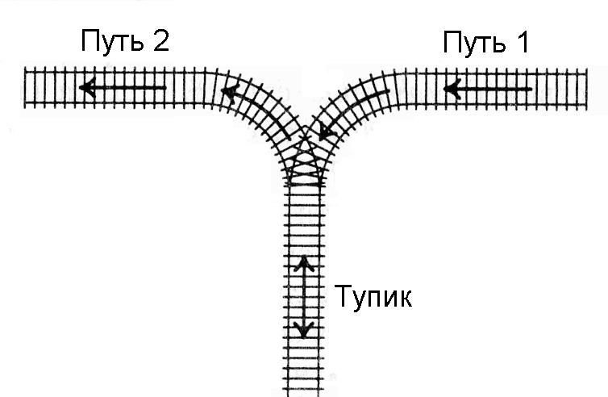

## 11

Научитесь пользоваться стандартной структурой данных stack для целых чисел. Напишите программу, содержащую описание стека и моделирующую работу стека, реализовав все указанные здесь методы. Программа считывает последовательность команд и в зависимости от команды выполняет ту или иную операцию. После выполнения каждой команды программа должна вывести одну строчку. Возможные команды для программы:
push n
Добавить в стек число n (значение n задается после команды). Программа должна вывести ok.
pop
Удалить из стека последний элемент. Программа должна вывести его значение.
back
Программа должна вывести значение последнего элемента, не удаляя его из стека.
size
Программа должна вывести количество элементов в стеке.
clear
Программа должна очистить стек и вывести ok.
exit
Программа должна вывести bye и завершить работу.
Перед исполнением операций back и pop программа должна проверять, содержится ли в стеке хотя бы один элемент. Если во входных данных встречается операция back или pop, и при этом стек пуст, то программа должна вместо числового значения вывести строку error.

### Формат ввода

Вводятся команды управления стеком, по одной на строке

### Формат вывода

Программа должна вывести протокол работы стека, по одному сообщению на строке

<i>Example 1:</i>

| In  | Out |
|:----|:---:|
| push 1<br>back<br>exit | ok<br>1<br>bye |

<i>Example 2:</i>

| In  | Out |
|:----|:---:|
| size<br>push 1<br>size<br>push 2<br>size<br>push 3<br>size<br>exit | 0<br>ok<br>1<br>ok<br>2<br>ok<br>3<br>bye |

<i>Example 3:</i>

| In  | Out |
|:----|:---:|
| push 3<br>push 14<br>size<br>clear<br>push 1<br>back<br>push 2<br>back<br>pop<br>size<br>pop<br>size<br>exit<br> | ok<br>ok<br>2<br>ok<br>ok<br>1<br>ok<br>2<br>2<br>1<br>1<br>0<br>bye |

```python
import sys

class Stack:
    def __init__(self):
        self.memory = list()


    def push(self, n: int):
        self.memory.append(n)


    def pop(self) -> int:
        if len(self.memory) > 0:
            return self.memory.pop()
        return None
    

    def back(self) -> int:
        if len(self.memory) > 0:
            return self.memory[-1]
        return None
    

    def size(self) -> int:
        return len(self.memory)
    

    def clear(self):
        self.memory.clear()


def main():
    stack = Stack()
    with open('input.txt', 'r') as inf:
        for line in inf:
            query = line.split()
            match query[0]:
                case 'push':
                    stack.push(int(query[1]))
                    print('ok')
                case 'pop':
                    temp = stack.pop()
                    print(temp if temp is not None else 'error')
                case 'back':
                    temp = stack.back()
                    print(temp if temp is not None else 'error')
                case 'size':
                    print(stack.size())
                case 'clear':
                    stack.clear()
                    print('ok')
                case 'exit':
                    print('bye')
                    sys.exit(0)
```

## 12

Рассмотрим последовательность, состоящую из круглых, квадратных и фигурных скобок. Программа дожна определить, является ли данная скобочная последовательность правильной. Пустая последовательность явлется правильной. Если A – правильная, то последовательности (A), [A], {A} – правильные. Если A и B – правильные последовательности, то последовательность AB – правильная.

### Формат ввода

В единственной строке записана скобочная последовательность, содержащая не более 100000 скобок.

### Формат вывода

Если данная последовательность правильная, то программа должна вывести строку yes, иначе строку no.

<i>Example 1:</i>

| In  | Out |
|:----|:---:|
| ()[] | yes |

<i>Example 2:</i>

| In  | Out |
|:----|:---:|
| ([)] | no |

<i>Example 3:</i>

| In  | Out |
|:----|:---:|
| ( | no |

```python
def main():
    with open('input.txt', 'r') as inf:
        braces = inf.readline()
        stack = list()
        for brace in braces:
            match brace:
                case '(' | '[' | '{':
                    stack.append(brace)
                case ')':
                    if len(stack) <= 0 or stack.pop() != '(':
                        return False
                case ']':
                    if len(stack) <= 0 or stack.pop() != '[':
                        return False
                case '}':
                    if len(stack) <= 0 or stack.pop() != '{':
                        return False

        if len(stack) > 0:
            return False
        return True
```

## 13

В постфиксной записи (или обратной польской записи) операция записывается после двух операндов. Например, сумма двух чисел A и B записывается как A B +. Запись B C + D * обозначает привычное нам (B + C) * D, а запись A B C + D * + означает A + (B + C) * D. Достоинство постфиксной записи в том, что она не требует скобок и дополнительных соглашений о приоритете операторов для своего чтения.

### Формат ввода

В единственной строке записано выражение в постфиксной записи, содержащее цифры и операции +, -, *. Цифры и операции разделяются пробелами. В конце строки может быть произвольное количество пробелов.

### Формат вывода

Необходимо вывести значение записанного выражения.

<i>Example 1:</i>

| In  | Out |
|:----|:---:|
| 8 9 + 1 7 - * | 102 |

```python
# Поиск ответа по обратной польской записи:
# а) если число, кладем в стек;
# б) если оператор, то достаем из стека последние два числа,
# проводим операцию и кладем резултат в стек.
# В конце в стеке останется лежать елинственное число - результат арифметического выражения
def main():
    stack = list()
    for symbol in input().split():
        if symbol.isdigit():
            stack.append(int(symbol))
        else:
            second = stack.pop()
            first = stack.pop()
            match symbol:
                case '+':
                    temp = first + second
                case '-':
                    temp = first - second
                case '*':
                    temp = first * second
            stack.append(temp)

    print(stack[-1])
```

## 14

К тупику со стороны пути 1 (см. рисунок) подъехал поезд. Разрешается отцепить от поезда один или сразу несколько первых вагонов и завезти их в тупик (при желании, можно даже завезти в тупик сразу весь поезд). После этого часть из этих вагонов вывезти в сторону пути 2. После этого можно завезти в тупик еще несколько вагонов и снова часть оказавшихся вагонов вывезти в сторону пути 2. И так далее (так, что каждый вагон может лишь один раз заехать с пути 1 в тупик, а затем один раз выехать из тупика на путь 2). Заезжать в тупик с пути 2 или выезжать из тупика на путь 1 запрещается. Нельзя с пути 1 попасть на путь 2, не заезжая в тупик.



Известно, в каком порядке изначально идут вагоны поезда. Требуется с помощью указанных операций сделать так, чтобы вагоны поезда шли по порядку (сначала первый, потом второй и т.д., считая от головы поезда, едущего по пути 2 в сторону от тупика). Напишите программу, определяющую, можно ли это сделать.

### Формат ввода

Вводится число N — количество вагонов в поезде (1 ≤ N ≤ 100). Дальше идут номера вагонов в порядке от головы поезда, едущего по пути 1 в сторону тупика. Вагоны пронумерованы натуральными числами от 1 до N, каждое из которых встречается ровно один раз.

### Формат вывода

Если сделать так, чтобы вагоны шли в порядке от 1 до N, считая от головы поезда, когда поезд поедет по пути 2 из тупика, можно, выведите сообщение YES, если это сделать нельзя, выведите NO.

<i>Example 1:</i>

| In  | Out |
|:----|:---:|
| 3<br>3 2 1 | YES |

<i>Example 2:</i>

| In  | Out |
|:----|:---:|
| 4<br>4 1 3 2 | YES |

<i>Example 3:</i>

| In  | Out |
|:----|:---:|
| 3<br>2 3 1 | NO |

```python
def main():
    stack = list()
    number_of_railtrucks = int(input())
    prev_number = -1
    # Кладем в стек числа в порядке убывания. Если в стеке лежат числа меньше текущего, то достаем их. То есть все числа, которые достанем, будут отсортированы по возрастанию. Если достали число меньшее, чем последнее, что лежит в ответе, значит последовательность в ответе не будет отсортирована.
    for railtruck_number in map(int, input().split()):
        while len(stack) > 0 and stack[-1] < railtruck_number:
            temp = stack.pop()
            if temp < prev_number:
                return False
            prev_number = temp
        stack.append(railtruck_number)
    while len(stack) > 0: 
        temp = stack.pop()
        if temp < prev_number:
            return False
        prev_number = temp
    return True
```

## 15

Лайнландия представляет из себя одномерный мир, являющийся прямой, на котором располагаются N городов, последовательно пронумерованных от 0 до N - 1 . Направление в сторону от первого города к нулевому названо западным, а в обратную — восточным.
Когда в Лайнландии неожиданно начался кризис, все были жители мира стали испытывать глубокое смятение. По всей Лайнландии стали ходить слухи, что на востоке живётся лучше, чем на западе.
Так и началось Великое Лайнландское переселение. Обитатели мира целыми городами отправились на восток, покинув родные улицы, и двигались до тех пор, пока не приходили в город, в котором средняя цена проживания была меньше, чем в родном.

### Формат ввода

В первой строке дано одно число N (2 ≤ N ≤ 10<sup>5</sup>) — количество городов в Лайнландии. Во второй строке дано N чисел ai (0 ≤ a<sub>i</sub> ≤ 10<sup>9</sup>) — средняя цена проживания в городах с нулевого по (N - 1)-ый соответственно.

### Формат вывода

Для каждого города в порядке с нулевого по (N - 1)-ый выведите номер города, в который переселятся его изначальные жители. Если жители города не остановятся в каком-либо другом городе, отправившись в Восточное Бесконечное Ничто, выведите -1 .

<i>Example 1:</i>

| In  | Out |
|:----|:---:|
| 10<br>1 2 3 2 1 4 2 5 3 1 | -1 4 3 4 -1 6 9 8 9 -1 |

```python
# Задача поиска первого меньшего числа справа для каждого числа последовательности. Поддерживаем в стеке возрастающую последовательность.
def main():
    number_of_cities = int(input())
    cities = ['-1' for _ in range(number_of_cities)]
    stack = list()
    for idx, number in enumerate(map(int, input().split())):
        while len(stack) > 0 and stack[-1][0] > number:
            temp = stack.pop()
            # Для всех городов, в которых цена проживания выше текущей, ставим индекс текущего города.
            cities[temp[1]] = str(idx)
        stack.append((number, idx))
    print(' '.join(cities))
```