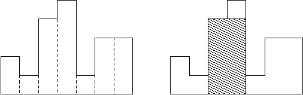

## 11

Для транспортирования материалов из цеха А в цех В используется конвейер. Материалы упаковываются в одинаковые контейнеры и размещаются на ленте один за одним в порядке изготовления в цехе А. Каждый контейнер имеет степень срочности обработки в цехе В. Для упорядочивания контейнеров по степени срочности используют накопитель, который находится в конце конвейера перед входом в цех В. Накопитель работает пошагово, на каждом шаге возможны следующие действия:
накопитель перемещает первый контейнер из ленты в цех В;
накопитель перемещает первый контейнер из строки в склад (в складе каждый следующий контейнер помещается на предыдущий);
накопитель перемещает верхний контейнер из склада в цех В.
Напишите программу, которая по последовательности контейнеров определит, можно ли упорядочить их по степени срочности пользуясь описанным накопителем.

### Формат ввода

Входной файл в первой строке содержит количество тестов N. Далее следует N строк, каждый из которых описывает отдельный тест и содержит целое число K (1 ≤ K ≤ 10000) — количество контейнеров в последовательности и K действительных чисел — степеней срочности контейнеров в порядке их поступления из цеха А (меньшим числам соответствует большая степень срочности).

### Формат вывода

Каждая строка выходного файла должна содержать ответ для одного теста. Необходимо вывести 1, если необходимое упорядочивание возможно, или 0 в противном случае.

<i>Example 1:</i>

| In  | Out |
|:----|:---:|
| 2<br>2 2.9 2.1<br>3 5.6 9.0 2.0 | 1<br>0 |

```python
# Аналог задачи В14
def test():
    temp = input().split()
    stack = list()
    prev_number = -1
    for priority in map(float, temp[1:]):
        while len(stack) > 0 and stack[-1] < priority:
            temp = stack.pop()
            if temp < prev_number:
                return '0'
            prev_number = temp
        stack.append(priority)
    while len(stack) > 0:
        temp = stack.pop()
        if temp < prev_number:
            return '0'
        prev_number = temp
    return '1'

def main():
    number_of_tests = int(input())
    answers = list()
    for _ in range(number_of_tests):
        answers.append(test())
    print('\n'.join(answers))
```

## 12

Задано числовое выражение. Необходимо вычислить его значение или установить, что оно содержит ошибку. В выражении могут встречаться знаки сложения, вычитания, умножения, скобки и пробелы (пробелов внутри чисел быть не должно). Приоритет операций стандартный. Все числа в выражении целые и по модулю не превосходят 2 × 10<sup>9</sup>. Также гарантируется, что все промежуточные вычисления также не превосходят 2 × 10<sup>9</sup>.

### Формат ввода

В первой строке вводится выражение. Его длина не превосходит 100 знаков. После выражения идет переход на новую строчку.

### Формат вывода

Выведите значение этого выражения или слово "WRONG если значение не определено.

<i>Example 1:</i>

| In | Out |
|:---|:---:|
| 1+(2*2 - 3) | 2 |

<i>Example 2:</i>

| In | Out |
|:---|:---:|
| 1+a+1 | WRONG |

<i>Example 3:</i>

| In | Out |
|:---|:---:|
| 1 1 + 2 | WRONG |

```python
# count reverse polish notation statement
def count_rpn_statement(reverse_polish_notation):
    stack = list()
    for symbol in reverse_polish_notation:
        if symbol.isdigit():
            stack.append(int(symbol))
        else:
            second = stack.pop()
            first = stack.pop()
            match symbol:
                case '+':
                    temp = first + second
                case '-':
                    temp = first - second
                case '*':
                    temp = first * second
            stack.append(temp)

    return str(stack[-1])


def get_reverse_polish_notation(statement) -> list:
    reverse_polish_notation = list()
    stack = list()
    number = list()
    digit = False
    operator = False
    number_split = False
    open_brace = False
    braces_balance = 0
    digits = ('0', '1', '2', '3', '4', '5', '6', '7', '8', '9')
    operators = {'+': 0, '-': 0, '*': 1}

    if statement[0] == '-':
        number.append('0')
        digit = True
    elif statement[0] in operators:
        return [None, 'first symbol is operator']

    for symbol in statement:
        if symbol.isalpha():
            return None, 'alpha'
        
        if symbol in digits:
            if number_split:
                return [None, f'number split {number_split}', symbol]
            digit = True
            operator = False
            open_brace = False
            number.append(symbol)

        elif symbol == ' ':
            if digit:
                number_split = True
                digit = False
                reverse_polish_notation.append(''.join(number))
                number.clear()
            open_brace = False

        elif symbol in operators:
            if open_brace:
                if symbol == '-':
                    reverse_polish_notation.append('0')
                    operator = False
                else:
                    return [None, 'operator after open brace', symbol]
            if operator:
                return [None, f'operator {operator}', symbol]
            if digit:
                digit = False
                reverse_polish_notation.append(''.join(number))
                number.clear()
            while len(stack) > 0 and stack[-1] != '(' and operators[stack[-1]] >= operators[symbol]:
                temp = stack.pop()
                if temp != '(':
                    reverse_polish_notation.append(temp)
            number_split = False
            operator = True
            stack.append(symbol)

        elif symbol == '(':
            if number_split or digit:
                return [None, f'number split {number_split} digit {digit}', symbol]
            braces_balance += 1
            open_brace = True
            stack.append(symbol)

        elif symbol == ')':
            if operator:
                return [None, f'operator {operator}', symbol]
            if braces_balance == 0:
                return [None, 'brace balance < 0']
            if digit:
                digit = False
                reverse_polish_notation.append(''.join(number))
                number.clear()
            while stack[-1] != '(':
                reverse_polish_notation.append(stack.pop())
            open_brace = False
            braces_balance -= 1
            number_split = False
            stack.pop()
    
    if braces_balance > 0:
        return [None, 'not all braces were closed']
    if operator:
        return [None, 'last symbol is operator', symbol]
    if len(number) > 0:
        reverse_polish_notation.append(''.join(number))
    for _ in range(len(stack)):
        reverse_polish_notation.append(stack.pop())
    return reverse_polish_notation


def main():
    reverse_polish_notation = get_reverse_polish_notation(input())
    if reverse_polish_notation[0] is None:
        print('WRONG')
    else:
        print(count_rpn_statement(reverse_polish_notation))
```

## 13

Задано логическое выражение. Необходимо вычислить его значение. В выражении могут встречаться знаки ! (отрицание), & (логическое «и»), | (логическое «или»), ̂ (XOR — «исключающее ИЛИ», «ровно одно из двух — истина») и скобки. Самый высокий приоритет у отрицания, меньше – у &, операции | и ̂ имеют самый низкий приоритет (одинаковый) и вычисляются слева направо. Все числа в выражении либо 0, либо 1.

### Формат ввода

В первой строке вводится выражение. Его длина не превосходит 100 знаков. После выражения идет переход на новую строчку.

### Формат вывода

Выведите значение этого выражения (0 или 1).

<i>Example 1:</i>

| In | Out |
|:---|:---:|
| 1|(0&0^1) | 1 |

```python
def count_logical_rpn_statement(reverse_polish_notation):
    stack = list()
    for symbol in reverse_polish_notation:
        if symbol.isdigit():
            stack.append(int(symbol))
        else:
            second = stack.pop()
            first = stack.pop()
            match symbol:
                case '!':
                    temp = not second
                case '&':
                    temp = first and second
                case '^':
                    temp = first != second
                case '|':
                    temp = first or second
            stack.append(int(temp))

    return int(stack[-1])


def get_logical_rpn(statement) -> list:
    reverse_polish_notation = list()
    stack = list()
    digit = False
    operator = False
    open_brace = False
    braces_balance = 0
    digits = ('0', '1')
    operators = {'|': 0, '^': 0, '&': 1, '!': 2}

    if statement[0] == '!':
        reverse_polish_notation.append('0')
    elif statement[0] in operators:
        return [None, 'first symbol is operator']

    for idx, symbol in enumerate(statement):
        if symbol.isalpha():
            return None, 'alpha'
        
        if symbol in digits:
            if digit:
                return [None, f'second digit in a row', symbol, idx]
            digit = True
            operator = False
            prev_operator = None
            open_brace = False
            reverse_polish_notation.append(symbol)

        elif symbol == ' ':
            digit = False
            open_brace = False

        elif symbol in operators:
            if open_brace or operator and prev_operator != '!':
                if symbol == '!':
                    reverse_polish_notation.append('0')
                    operator = False
                else:
                    return [None, 'operator after open brace', symbol, idx]
            if operator:
                return [None, f'second operator in a row', symbol, idx]
            while len(stack) > 0 and stack[-1] != '(' and operators[stack[-1]] >= operators[symbol]:
                reverse_polish_notation.append(stack.pop())
            digit = False
            operator = True
            prev_operator = symbol
            stack.append(symbol)

        elif symbol == '(':
            if digit:
                return [None, f'open brace after digit', idx]
            braces_balance += 1
            open_brace = True
            stack.append(symbol)

        elif symbol == ')':
            if operator:
                return [None, f'operator before close brace', idx]
            if braces_balance == 0:
                return [None, 'brace balance < 0']
            while stack[-1] != '(':
                reverse_polish_notation.append(stack.pop())
            digit = False
            open_brace = False
            braces_balance -= 1
            stack.pop()
    
    if braces_balance > 0:
        return [None, 'not all braces were closed']
    if operator:
        return [None, 'last symbol is operator', symbol]
    for _ in range(len(stack)):
        reverse_polish_notation.append(stack.pop())
    return reverse_polish_notation


def main():
    reverse_polish_notation = get_logical_rpn(input().strip())
    print(reverse_polish_notation)
    if reverse_polish_notation[0] is None:
        print('WRONG')
    else:
        print(count_logical_rpn_statement(reverse_polish_notation))
```

## 14

Гистограмма является многоугольником, сформированным из последовательности прямоугольников, выровненных на общей базовой линии. Прямоугольники имеют равную ширину, но могут иметь различные высоты. Например, фигура слева показывает гистограмму, которая состоит из прямоугольников с высотами 2, 1, 4, 5, 1, 3, 3. Все прямоугольники на этом рисунке имеют ширину, равную 1.



Обычно гистограммы используются для представления дискретных распределений, например, частоты символов в текстах. Отметьте, что порядок прямоугольников очень важен. Вычислите область самого большого прямоугольника в гистограмме, который также находится на общей базовой линии. На рисунке справа заштрихованная фигура является самым большим выровненным прямоугольником на изображенной гистограмме.

### Формат ввода

В первой строке входного файла записано число N (0 < N ≤ 10<sup>6</sup>) — количество прямоугольников гистограммы. Затем следует N целых чисел h<sub>1</sub>,...,h<sub>n</sub>, где 0 ≤ h<sub>i</sub> ≤ 10<sup>6</sup>. Эти числа обозначают высоты прямоугольников гистограммы слева направо. Ширина каждого прямоугольника равна 1

### Формат вывода

Выведите площадь самого большого прямоугольника в гистограмме. Помните, что этот прямоугольник должен быть на общей базовой линии.

<i>Example 1:</i>

| In | Out |
|:---|:---:|
| 7 2 1 4 5 1 3 3 | 8 |

```python
def main():
    heights = list(map(int, input().split()))
    length = heights[0]
    stack = list()
    # Кладем прямоугольник нулевой ширины и отрицательной высоты, чтобы в конце точно обработать оставшиеся в стеке элементы.
    stack.append((0, -1))
    max_area = 0
    # В стеке всегда возрастающая последовательность. Если встретили значение меньше, выталкиваем из стека элементы по одному и считаем площадь, обновляем при этом максимум. Когда вытолкнули все, что могли, кладем в стек элемент с высотой текущего, но шириной равной (i - номер последнего вытолкнутого).
    for i in range(1, length + 2):
        if i <= length:
            height = heights[i]
        else:
            height = 0
        x = i
        while height <= stack[-1][1]:
            x = stack[-1][0]
            y = stack[-1][1]
            stack.pop()
            area = y * (i - x)
            if area > max_area:
                max_area = area
        stack.append((x, height))
    print(max_area)

# Находим первый меньший слева для каждого столбца гистрограммы и первого меньшего справа. Затем идем по всем столбцам, считаем площадь прямоугольника как (первый меньший справа - первый меньшй слева) * высота столюца и обновляем максимум.
```

## 15

Формат XML является распространенным способом обмена данными между различными программами. Недавно программист Иванов написал небольшую программу, которая сохраняет некоторую важную информацию в виде XML-строки.
XML-строка состоит из открывающих и закрывающих тегов.
Открывающий тег начинается с открывающей угловой скобки (<), за ней следует имя тега — непустая строка из строчных букв латинского алфавита, а затем закрывающая угловая скобка (>). Примеры открывающих тегов: &lt;a>, &lt;dog>.
Закрывающий тег начинается с открывающей угловой скобки, за ней следует прямой слеш (/), затем имя тега — непустая строка из строчных букв латинского алфавита, а затем закрывающая угловая скобка. Примеры закрывающихся тегов: &lt;/a>, &lt;/dog>.
XML-строка называется корректной, если она может быть получена по следующим правилам:
* Пустая строка является корректной XML-строкой.
* Если A и B — корректные XML-строки, то строка AB, получающаяся приписыванием строки B в конец строки A, также является корректной XML-строкой.
* Если A — корректная XML-строка, то строка &lt;X>A&lt;/X>, получающаяся приписыванием в начало A открывающегося тега, а в конец — закрывающегося с таким же именем, также является корректной XML-строкой. Здесь X — любая непустая строка из строчных букв латинского алфавита.

Например, представленные ниже строки:<br>
&lt;a>&lt;/a><br>
&lt;a>&lt;ab>&lt;/ab>&lt;c>&lt;/c>&lt;/a><br>
&lt;a>&lt;/a>&lt;a>&lt;/a>&lt;a>&lt;/a><br>
являются корректными XML-строками, а такие строки как:<br>
&lt;a>&lt;/b><br>
&lt;a>&lt;b><br>
&lt;a>&lt;b>&lt;/a>&lt;/b><br>
не являются корректными XML-строками.
Иванов отправил файл с сохраненной XML-строкой по электронной почте своему коллеге Петрову. Однако, к сожалению, файл повредился в процессе пересылки: ровно один символ в строке заменился на некоторый другой символ.
Требуется написать программу, которая по строке, которую получил Петров, восстановит исходную XML-строку, которую отправлял Иванов.

### Формат ввода

Входной файл содержит одну строку, которая заменой ровно одного символа может быть превращена в корректную XML-строку. Длина строки лежит в пределах от 7 до 1000, включительно. Строка содержит только строчные буквы латинского алфавита и символы «<» (ASCII код 60), «>»(ASCII код 62) и «/»(ASCII код 47). Строка во входном файле заканчивается переводом строки.

### Формат вывода

Выходной файл должен содержать корректную XML-строку, которая может быть получена из строки во входном файле заменой ровно одного символа на другой. Если вариантов ответа несколько, можно вывести любой.

<i>Example 1:</i>

| In | Out |
|:---|:---:|
| &lt;a>&lt;/b> | &lt;b>&lt;/b> |

<i>Example 2:</i>

| In | Out |
|:---|:---:|
| &lt;a>&lt;aa> | &lt;a>&lt;/a> |

<i>Example 3:</i>

| In | Out |
|:---|:---:|
| &lt;a><>a> | &lt;a>&lt;/a> |

<i>Example 4:</i>

| In | Out |
|:---|:---:|
| &lt;a/&lt;/a> | &lt;a>&lt;/a> |

```python
Регулярочки
```