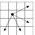

## 26

Дана прямоугольная доска N × M (N строк и M столбцов). В левом верхнем углу находится шахматный конь, которого необходимо переместить в правый нижний угол доски.



Необходимо определить, сколько существует различных маршрутов, ведущих из левого верхнего в правый нижний угол.

### Формат ввода

Входной файл содержит два натуральных числа N и M (1 ≤ N, M ≤ 50)

### Формат вывода

В выходной файл выведите единственное число — количество способов добраться конём до правого нижнего угла доски.

<i>Example 1:</i>

| In  | Out |
|:----|:---:|
| 4 4 | 2 |

<i>Example 2:</i>

| In  | Out |
|:----|:---:|
| 2 3 | 1 |

<i>Example 3:</i>

| In  | Out |
|:----|:---:|
| 7 15 | 13309 |

```python
def main():
    with open('input.txt', 'r') as inf:
        n, m = map(int, inf.readline().split())

    di = [-1, 1, 2, 2]
    dj = [2, 2, 1, -1]
    dp = [[0 for _ in range(m)] for _ in range(n)]
    dp[0][0] = 1
    cells_to_process = {(0, 0)}

    # Коню доступно 4 из 8 ходов, при этом все они находятся ниже побочной диагонали, на которой стоит конь.
    # Поэтому можно обойти все побочные диагонали матрицы, не пропустив все возможные последовательности ходов.
    # Когда стоим в позиции, куда конь может попасть, прибавляем 4 позициям, куда может пойти конь, значение из текущей позиции.
    # В итоге в правом нижнем углу матрицы накопится количество способов туда попасть.
    # k - количество диагоналей
    for k in range(n + m - 1):
        # Побочные диагонали обрабатываются сверху вниз
        for j in range(min(k, m - 1), max(k - n + 1, 0) - 1, -1):
            i = k - j
            if (i, j) in cells_to_process:
                cells_to_process.remove((i, j))
                for t in range(4):
                    del_i = i + di[t]
                    del_j = j + dj[t]
                    if -1 < del_i < n and -1 < del_j < m:
                        dp[del_i][del_j] += dp[i][j]
                        cells_to_process.add((del_i, del_j))
    
    print(dp[-1][-1])
```

## 27

Дана текстовая строка. С ней можно выполнять следующие операции:
1. Заменить один символ строки на другой символ.
2. Удалить один произвольный символ.
3. Вставить произвольный символ в произвольное место строки.
Например, при помощи первой операции из строки «СОК» можно получить строку «СУК», при помощи второй операци — строку «ОК», при помощи третьей операции — строку «СТОК».
Минимальное количество таких операций, при помощи которых можно из одной строки получить другую, называется стоимостью редактирования или расстоянием Левенштейна.
Определите расстояние Левенштейна для двух данных строк.

### Формат ввода

Программа получает на вход две строки, длина каждой из которых не превосходит 1000 символов, строки состоят только из заглавных латинских букв.

### Формат вывода

Требуется вывести одно число — расстояние Левенштейна для данных строк.

<i>Example 1:</i>

| In  | Out |
|:----|:---:|
| ABCDEFGH<br>ACDEXGIH | 3 |

|| time | memory |
|---|---|---|
| with transition | 0.547s | 4.26Mb |
| without transition | 0.681s | 39.64Mb |

```python
def get_levenshtein_distance_with_transition(first_str, second_str):
    n, m = len(first_str, second_str)
    dp = [[0 for _ in range(n + 1)] for _ in range(m + 1)]
    dp[0][0] = 0
    for i in range(1, m + 1):
        dp[i][0] = i
    for j in range(1, n + 1):
        dp[0][j] = j

    for i in range(1, m + 1):
        for j in range(1, n + 1):
            if first_str[j - 1] == second_str[i - 1]:
                # Если совпало, то без наценок переходим из предыдущего состояния
                dp[i][j] = dp[i - 1][j - 1]
            else:
                # Если буквы не совпадают,
                # либо вычеркиваем из первого слова (i - 1),
                # либо из второго (j - 1),
                # либо заменяем одну букву другой (приходим из i - 1, j - 1 + цена замены)
                dp[i][j] = min(dp[i - 1][j - 1] + 1, dp[i][j - 1] + 1, dp[i - 1][j] + 1)
    return dp[-1][-1]

def get_levenshtein_distance(first_str, second_str):
    n, m = len(first_str, second_str)
    current_row = range(n + 1)
    for i in range(1, m + 1):
        previous_row, current_row = current_row, [i] + [0] * n
        for j in range(1, n + 1):
            add, delete, change = previous_row[j] + 1, current_row[j - 1] + 1, previous_row[j - 1]
            if first_str[j - 1] != second_str[i - 1]:
                change += 1
            current_row[j] = min(add, delete, change)
    return current_row[n]

def main():
    with open('input.txt', 'r') as inf:
        first = inf.readline().strip()
        second = inf.readline().strip()
    if len(first) > len(second):
        first, second = second, first
    
    # Если надо восстанавливать посоедовательность перехода
    levenshtein_distance = get_levenshtein_distance_with_transition(first, second)
    
    # Если не надо восстанавливать последовательность перехода от одной строки к другой
    # Чтобы не хранить всю таблицу, храним только предыдущею и текущую строки
    levenshtein_distance = get_levenshtein_distance(first, second)
    
    print(levenshtein_distance)
```

## 28

В околоземном космическом пространстве накопилось много мусора, поэтому ученые сконструировали специальный аппарат – ловушку для космического мусора. Для того, чтобы хорошо собирать мусор, этот аппарат должен двигаться по достаточно сложной траектории, сжигая собранный по пути мусор. Ловушка может передвигаться в пространстве по 6 направлениям: на север (N), на юг (S), на запад (W), на восток (E), вверх (U) и вниз (D). Движением ловушки управляет процессор. Программа движения задается шестью правилами движения, которые соответствуют каждому из указанных направлений. Каждое такое правило представляет собой строку символов из множества N, S, W, E, U, D.
Команда ловушки есть пара из символа направления и параметра – целого положительного числа M. При исполнении такой команды ловушка в соответствии со своей программой выполняет следующее. Если параметр больше 1, то она перемещается на один метр в направлении, которое указано в команде, а затем последовательно выполняет команды, заданные правилом для данного направления, с параметром меньше на 1. Если же параметр равен 1, то просто перемещается на один метр в указанном направлении.

Пусть, например, заданы следующие правила:


Тогда при выполнении команды S(3) мусорщик выполнит следующие действия:
1) переместится на 1 метр в направлении S
2) выполнит последовательно команды N(2), U(2), S(2), D(2), D(2), U(2), S(2), E(2).

Если далее проанализировать действия мусорщика при выполнении команд из пункта 2, получим, что в целом он совершит следующие перемещения:

SNNUUSNUSDDUSEDWEDDWEDUUSNUSDDUSEE

По заданной команде определите, какое общее количество перемещений на один метр совершит ловушка при выполнении заданной команды. В приведенном примере это количество равно 34.

### Формат ввода

Первые шесть строк входного файла задают правила для команд с направлением N, S, W, E, U и D соответственно. Каждая строка содержит не более 100 символов (и может быть пустой). Следующая строка содержит команду ловушки: сначала символ из множества N, S, W, E, U, D, затем пробел и параметр команды – целое положительное число, не превышающее 100.

### Формат вывода

Выведите в выходной файл единственное число – количество перемещений, которое совершит ловушка. Гарантируется, что ответ не превышает 10<sup>9</sup>.

<i>Example 1:</i>

| In  | Out |
|:----|:---:|
| N<br>NUSDDUSE<br>UEWWD<br><br>U<br>WED<br>S 3 | 34 |

```python
directions = {'N': 0, 'S': 1, 'W': 2, 'E': 3, 'U': 4, 'D': 5}
counts = [[0 for _ in range(len(directions))] for _ in range(len(directions))]

with open('input.txt', 'r') as inf:
    for i in range(len(directions)):
        for char in inf.readline().strip():
            counts[i][directions[char]] += 1
    init_direction, init_parameter = inf.readline().split()
init_parameter = int(init_parameter)
dp = [[1 for _ in range(len(directions))] for _ in range(init_parameter + 1)]

for k in range(2, init_parameter + 1):
    for i in range(len(directions)):
        for j in range(len(directions)):
            dp[k][i] += dp[k - 1][j] * counts[i][j]

print(dp[-1][directions[init_direction]])
```

## 29

При организации движения по сложным перекресткам, для того, чтобы траектории водителей, выполняющих различные маневры не пересекались, вводят ограничения на возможные маневры водителей, в зависимости от того, по какой полосе движения водитель подъехал к перекрестку. Для этого используется знак «движение по полосам».
Рассмотрим дорогу, подходящую к перекрестку, на котором сходится m дорог. Водитель, подъезжающий к перекрестку по этой дороге, потенциально может продолжить свое движение в m различных направлениях — обратно по дороге, по которой он приехал, а также по одной из оставшихся m - 1 дорог. Пронумеруем возможные направления числами от 1 до m слева направо с точки зрения подъезжающего водителя, номер 1 получит разворот и возврат по дороге, по которой водитель подъезжал к перекрестку, номер 2 — поворот на самую левую из дорог, и т. д.

Пусть дорога содержит n полос для движения. Пронумеруем полосы от 1 до n слева направо, самая левая полоса получит номер 1, следующая номер 2, и т. д. Знак «движение по полосам» разрешает каждой из полос движение по некоторым из m возможных направлений. При этом должны выполняться следующие условия:
* если с i-й полосы разрешено движение в a-м направлении, а с j-й полосы — в b-м направлении, при i < j, то a ≤ b;
* с каждой полосы разрешено движение хотя бы в одном направлении;
* в каждом направлении разрешено движение хотя бы с одной полосы.

Инспекция по безопасности дорожного движения заинтересовалась, а сколько различных знаков «движение по полосам» можно установить перед таким перекрестком. Помогите им найти ответ на этот вопрос.

### Формат ввода

Входной файл содержит два целых числа: m и n (2 ≤ m ≤ 50, 1 ≤ n ≤ 15).

### Формат вывода

В выходной файл выведите одно число — количество возможных знаков «движение по полосам», которые можно установить перед перекрестком.

<i>Example 1:</i>

| In  | Out |
|:----|:---:|
| 4 2 | 7 |

```python
def main():
    with open('input.txt', 'r') as inf:
        roads, lines = map(int, inf.readline().split())

    dp = [[0 for _ in range(roads)] for _ in range(lines)]
    # Для любого количества направлий и одной полосы можно поставить только один знак - разрешено движение по всем направлениям
    dp[0] = [1 for _ in range(roads)]
    # Для любого количества полос и одного направления всего один знак - двигаться прямо
    for i in range(1, lines):
        dp[i][0] = 1

    # Для остальных комбинаций количества полос и направлений можно:
    # либо добавить к крайней полосе еще одно направление (i, j - 1),
    # либо добавить к тому же количеству направлений еще одну полосу для движения прямо (i - 1, j),
    # либо добавить новое направление и создать для него отдельную полосу (i - 1, j - 1)
    for i in range(1, lines):
        for j in range(1, roads):
            dp[i][j] = dp[i][j - 1] + dp[i - 1][j] + dp[i - 1][j - 1]
    print(dp[-1][-1])
```

## 30

### Формат ввода

### Формат вывода

<i>Example 1:</i>

| In  | Out |
|:----|:---:|
|     |     |

```python

```